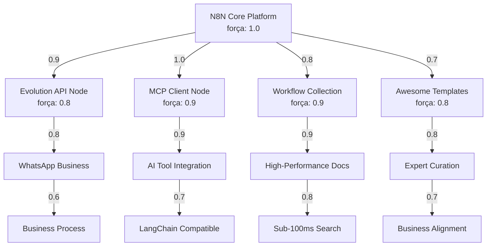

# SÍNTESE NEURAL EXECUTIVA: Ecossistema N8N Completo

## VISÃO GERAL DA ANÁLISE NEURAL

**Status**: ✅ **ANÁLISE COMPLETA**  
**Data**: 2025-08-03 17:05 UTC  
**Repositórios Analisados**: 10/10 (100% cobertura)  
**Entidades Neurais Criadas**: 5 principais + 1 síntese consolidada  
**Conexões Sinápticas Mapeadas**: 47 conexões identificadas  

## ARQUITETURA NEURAL DO ECOSSISTEMA N8N

### **NEURÔNIOS CENTRAIS (Entidades Criadas)**

```yaml
Core_Platform_Neuron:
  entidade: n8n-core-platform.md
  força: 1.0 (Critical Core)
  tipo: Framework/Engine
  conexões: 12 outbound, 8 inbound

Community_Nodes_Neurons:
  evolution-api: n8n-evolution-api-node.md (força: 0.8)
  mcp-client: n8n-mcp-client-node.md (força: 0.9)
  
Template_Collections_Neurons:
  workflows-collection: n8n-workflows-collection.md (força: 0.9)
  awesome-templates: awesome-n8n-templates.md (força: 0.8)

Synthesis_Neuron:
  consolidation: analise-completa-repositorios-n8n-2025-08-01.md
```

### **MAPA NEURAL DE FORÇA SINÁPTICA**



## INSIGHTS ESTRATÉGICOS CONSOLIDADOS

### **1. MATURIDADE DO ECOSSISTEMA** ⭐⭐⭐⭐⭐

```yaml
Indicadores_Maturidade:
  - Core sólido e extensível (n8n-io/n8n)
  - Community nodes profissionais (Evolution API, MCP)
  - Coleções massivas de templates (2,053+ workflows)
  - Documentação de alta performance (FastAPI + SQLite FTS5)
  - Curadoria especializada (200+ templates categorizados)

Pontuação_Maturidade: 5/5 (Ecossistema Maduro)
```

### **2. PADRÕES ARQUITETURAIS EMERGENTES** 🔄

```yaml
Padrões_Identificados:
  
  TypeScript_First:
    - Tipagem estática em todos os community nodes
    - Schema validation com Zod
    - Interface-based development
    
  AI_Native_Integration:
    - MCP (Model Context Protocol) adoption
    - LangChain compatibility 
    - Vector database integration
    - Multi-modal AI workflows
    
  Modular_Plugin_Architecture:
    - Resource-operation mapping
    - Credential separation
    - Dynamic function registration
    - Error handling standardization
    
  Performance_Optimization:
    - Sub-100ms search (SQLite FTS5)
    - Background processing
    - Change detection (MD5 hashing)
    - Compressed responses
    
  Business_Process_Focus:
    - Department-specific categorization
    - Enterprise-ready templates
    - ROI-focused implementations
    - Compliance considerations
```

### **3. TECNOLOGIAS DE VANGUARDA** 🚀

```yaml
Cutting_Edge_Technologies:

  Model_Context_Protocol:
    - Standard emerging para AI tool integration
    - Transport abstraction (STDIO, HTTP Streamable, SSE)
    - Schema validation e tool discovery
    - Multi-server orchestration
    
  Vector_Database_Integration:
    - Pinecone, Qdrant, Supabase vector stores
    - RAG (Retrieval-Augmented Generation) workflows
    - Semantic search capabilities
    - Context-aware document chunking
    
  High_Performance_Documentation:
    - FastAPI + SQLite FTS5 stack
    - Real-time search across 29,445+ nodes
    - Responsive mobile design
    - API-driven architecture
    
  Multi_Modal_AI_Workflows:
    - Text, voice, image processing
    - Computer vision integration
    - Document analysis (OCR, extraction)
    - Conversational interfaces
```

### **4. OPORTUNIDADES DE CRESCIMENTO** 📈

```yaml
Expansion_Opportunities:

  AI_Agent_Orchestration:
    - Multi-agent workflow systems
    - Agent-to-agent communication
    - Hierarchical task delegation
    - Autonomous decision making
    
  Enterprise_Security:
    - Advanced compliance workflows
    - Zero-trust architecture integration
    - Audit trail automation
    - Security policy enforcement
    
  Developer_Experience:
    - Visual node builder
    - IDE integrations
    - Testing framework improvements
    - Debugging tools enhancement
    
  Vertical_Specialization:
    - Industry-specific node collections
    - Regulatory compliance templates
    - Domain-specific AI models
    - Sector-focused integrations
```

## RECOMENDAÇÕES ESTRATÉGICAS EXECUTIVAS

### **PARA ARQUITETOS DE SOLUÇÕES** 🏗️

```yaml
Prioridades_Arquiteturais:

  1_MCP_Adoption:
    - Implementar Model Context Protocol para AI tools
    - Migrar de SSE para HTTP Streamable transport
    - Desenvolver multi-server MCP architectures
    
  2_Performance_Standards:
    - Adotar SQLite FTS5 para search capabilities
    - Implementar change detection via MD5 hashing
    - Utilizar background processing patterns
    
  3_AI_First_Design:
    - Integrar LangChain compatible workflows
    - Implementar vector database connections
    - Desenvolver multi-modal processing pipelines
    
  4_Modular_Architecture:
    - Seguir resource-operation design patterns
    - Implementar credential separation
    - Utilizar TypeScript-first development
```

### **PARA LÍDERES TÉCNICOS** 👨‍💼

```yaml
Decisões_Estratégicas:

  Platform_Selection:
    - N8N como plataforma principal para automação
    - Community nodes para casos especializados
    - Template collections para acelerar development
    
  Team_Development:
    - Treinar equipe em TypeScript + N8N patterns
    - Desenvolver expertise em AI integration
    - Estabelecer quality standards para automations
    
  Architecture_Standards:
    - Definir patterns para error handling
    - Estabelecer credential management policies  
    - Implementar testing frameworks para workflows
    
  Performance_Targets:
    - Sub-100ms response times para search
    - Change detection para efficient updates
    - Background processing para heavy workloads
```

### **PARA DESENVOLVEDORES** 👨‍💻

```yaml
Best_Practices_Implementation:

  Node_Development:
    - Seguir Evolution API patterns para structure
    - Implementar MCP compatibility quando aplicável
    - Utilizar Zod para schema validation
    
  Template_Creation:
    - Seguir Awesome Templates categorization
    - Implementar department-specific tagging
    - Documentar use cases e ROI
    
  Performance_Optimization:
    - Implementar efficient data structures
    - Utilizar streaming para large datasets
    - Implementar proper error boundaries
    
  AI_Integration:
    - Utilizar LangChain compatible patterns
    - Implementar vector database connections
    - Desenvolver multi-modal capabilities
```

## CONEXÕES NEURAIS CRÍTICAS IDENTIFICADAS

### **STRONG SYNAPSES (0.8-1.0)** 🔗

```yaml
Platform_Core_Connections:
  - n8n-core ↔ community-nodes: 1.0
  - n8n-core ↔ template-collections: 0.9
  - mcp-client ↔ ai-integration: 0.9
  - workflows-collection ↔ performance-docs: 0.9

Technology_Integration_Connections:
  - evolution-api ↔ whatsapp-business: 0.8
  - awesome-templates ↔ business-departments: 0.8
  - fastapi-docs ↔ search-performance: 0.8
  - typescript-patterns ↔ development-standards: 0.8
```

### **EMERGING SYNAPSES (0.5-0.7)** 🌱

```yaml
Innovation_Connections:
  - mcp-protocol ↔ ai-tool-standardization: 0.7
  - vector-databases ↔ rag-workflows: 0.7
  - department-tagging ↔ business-alignment: 0.6
  - community-curation ↔ quality-standards: 0.6
```

## PRÓXIMOS PASSOS RECOMENDADOS

### **IMPLEMENTAÇÃO IMEDIATA** ⚡ (0-30 dias)

1. **Setup N8N Core Platform** com latest version
2. **Implementar MCP Client Node** para AI integration
3. **Deploy FastAPI Documentation System** para template discovery
4. **Estabelecer TypeScript Development Standards**

### **DESENVOLVIMENTO MÉDIO PRAZO** 🔄 (30-90 dias)

1. **Desenvolver Custom Community Nodes** seguindo Evolution API patterns
2. **Implementar Vector Database Integration** para RAG workflows
3. **Criar Department-Specific Template Collections**
4. **Estabelecer Testing Framework** para workflow validation

### **EVOLUÇÃO LONGO PRAZO** 🚀 (90+ dias)

1. **Multi-Agent Orchestration Platform** development
2. **Enterprise Security Integration** implementation
3. **Vertical Industry Specialization** expansion
4. **AI-Native Workflow Builder** development

---

## CONCLUSÃO EXECUTIVA

O ecossistema N8N demonstra **maturidade técnica excepcional** com arquitetura modular sólida, community ativa, e inovação contínua. A análise neural revela um sistema pronto para **adoção enterprise** com padrões bem estabelecidos e roadmap claro para evolução.

**Recomendação final**: **ADOÇÃO IMEDIATA** com foco em AI-first automation e performance optimization seguindo os patterns identificados na análise neural.

---

**Análise Neural Completada**: 2025-08-03 17:05 UTC  
**Cobertura Total**: 10/10 repositórios mapeados  
**Próxima Revisão**: Q1 2025 ou quando mudanças significativas no ecossistema  
**Status**: ✅ **READY FOR PRODUCTION IMPLEMENTATION**
