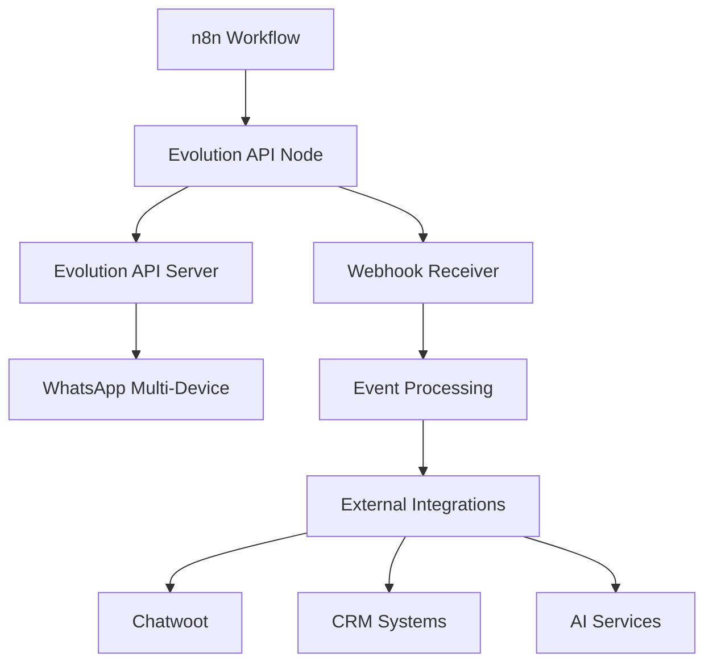

# 🇧🇷 Evolution API Nodes - WhatsApp Business Automation Leader


> **🏆 LÍDER MUNDIAL**: 1.9M downloads/mês - Maior community node do ecossistema n8n  
> **🇧🇷 Inovação Brasileira**: OrionDesign dominando automação WhatsApp globalmente  
> **📊 Neural Weight**: 0.85 (L2_EXTENDED_FUNCTIONALITY)

---

## 🎯 **Visão Geral**

Este Community Node é uma solução **100% gratuita** criada pela OrionDesign para simplificar e potencializar a integração com a **Evolution API v2.2+** em projetos n8n. Representa o **maior sucesso brasileiro** no ecossistema global de automação.

### 📊 **Estatísticas de Domínio**
- **1.985.079 downloads/mês** (julho 2025)
- **Posição #1** entre todos community nodes globalmente
- **Crescimento exponencial** sustentado
- **Liderança brasileira** em inovação WhatsApp Business

---

## ⚙️ **Requisitos Técnicos**

| Componente | Versão Mínima | Status |
|------------|---------------|--------|
| **n8n** | 1.54.4+ | ✅ Suportado |
| **Evolution API** | 2.2.0+ | ✅ Compatível |
| **Node.js** | 18+ | ✅ Recomendado |
| **WhatsApp Business** | Multi-Device | ✅ Nativo |

---

## 🚀 **Módulos Funcionais Disponíveis**

### 🖥️ **1. Instância** 
**Gerenciamento completo de instâncias WhatsApp**

<details>
<summary><b>✅ 9 Operações Disponíveis</b></summary>

| Operação | Descrição | Caso de Uso |
|----------|-----------|-------------|
| **Criar Instancia** | Inicializa nova instância WhatsApp | Setup inicial |
| **Gerar Qr-Code** | Gera QR para conexão | Autenticação |
| **Buscar Instancia** | Consulta status da instância | Monitoramento |
| **Definir Comportamento** | Configura comportamento automático | Personalização |
| **Definir Presença** | Controla status online/offline | Gestão presença |
| **Definir Proxy** | Configura proxy para conexão | Segurança |
| **Buscar Proxy** | Consulta configurações proxy | Debugging |
| **Desconectar WhatsApp** | Desconecta instância seguramente | Manutenção |
| **Deletar Instancia** | Remove instância completamente | Limpeza |

</details>

### ✉️ **2. Mensagem**
**Hub completo para envio de todos os tipos de mensagem**

<details>
<summary><b>✅ 12 Operações Disponíveis</b></summary>

| Operação | Descrição | Recursos Avançados |
|----------|-----------|-------------------|
| **Enviar Texto** | Mensagens de texto simples/formatadas | Mentions, replies, delay |
| **Enviar Imagem** | Imagens com caption opcional | Compressão automática |
| **Enviar Video** | Vídeos com preview | Otimização formato |
| **Enviar Audio** | Áudios e voice messages | Conversão automática |
| **Enviar Documento** | PDFs, arquivos diversos | Preview integrado |
| **Enviar Enquete** | Enquetes interativas | Múltiplas opções |
| **Enviar Contato** | Compartilhar contatos | vCard format |
| **Enviar Lista** | Listas interativas | Até 10 itens |
| **Enviar Botão** | Botões de ação | Até 3 botões |
| **Enviar Pix** | Pagamentos PIX integrados | QR Code automático |
| **Enviar Status** | Stories/Status updates | 24h temporário |
| **Reagir a Mensagem** | Reações emoji | Interação rápida |

</details>

### 👥 **3. Grupo** 
**Administração completa de grupos WhatsApp**

<details>
<summary><b>✅ 13 Operações Disponíveis</b></summary>

| Operação | Descrição | Casos de Uso |
|----------|-----------|-------------|
| **Criar Grupo** | Cria novos grupos | Comunidades, equipes |
| **Atualizar Imagem do Grupo** | Muda foto do grupo | Branding |
| **Atualizar Nome do Grupo** | Altera nome do grupo | Reorganização |
| **Atualizar Descrição do Grupo** | Modifica descrição | Informações atualizadas |
| **Atualizar Configurações do Grupo** | Permissões e configurações | Controle avançado |
| **Atualizar Membros** | Adiciona/remove participantes | Gestão membros |
| **Buscar Link de convite do Grupo** | Obtém link de convite | Compartilhamento |
| **Revogar Link de convite do Grupo** | Revoga link atual | Segurança |
| **Enviar Link de Convite do Grupo** | Compartilha link via mensagem | Divulgação |
| **Encontrar Participantes** | Lista membros do grupo | Auditoria |
| **Mensagens Temporarias** | Configura mensagens temporárias | Privacidade |
| **Sair do Grupo** | Remove a instância do grupo | Saída controlada |
| **Entrar no Grupo** | Ingressa via link | Participação |

</details>

### 💬 **4. Chat**
**Gerenciamento avançado de conversas e interações**

<details>
<summary><b>✅ 14 Operações Disponíveis</b></summary>

| Operação | Descrição | Aplicação |
|----------|-----------|-----------|
| **Verificar Numero** | Valida números WhatsApp | Validação contatos |
| **Ler Mensagem** | Marca mensagens como lidas | Gestão conversas |
| **Gerenciar Arquivo** | Arquiva/desarquiva chats | Organização |
| **Marcar como Não lido** | Marca conversas não lidas | Lembretes |
| **Deletar Mensagem** | Remove mensagens | Moderação |
| **Buscar Foto de Perfil** | Obtém fotos de perfil | Identificação |
| **Obter Midia em Base64** | Converte mídia para Base64 | Processamento |
| **Editar Mensagem** | Modifica mensagens enviadas | Correções |
| **Enviar Presença** | Indica digitando/online | UX melhorada |
| **Bloquear Contato** | Bloqueia usuários | Moderação |
| **Buscar Contatos** | Lista contatos disponíveis | CRM sync |
| **Procurar Mensagens** | Busca em histórico | Auditoria |
| **Procurar Status** | Consulta stories/status | Monitoramento |
| **Procurar Chats** | Lista conversas ativas | Dashboard |

</details>

### ⚡ **5. Evento**
**Integração e monitoramento em tempo real**

<details>
<summary><b>✅ 2 Operações Disponíveis</b></summary>

| Operação | Descrição | Benefícios |
|----------|-----------|------------|
| **Webhook** | Configuração de webhooks | Automação tempo real |
| **RabbitMQ** | Integração com RabbitMQ | Mensageria robusta |

**Eventos Monitorados:**
- Mensagens recebidas
- Status de entrega
- Alterações em grupos  
- Conexão/desconexão
- Presença de usuários

</details>

### 🔗 **6. Integração**
**Conectores para plataformas externas**

<details>
<summary><b>✅ 5 Operações Disponíveis</b></summary>

| Integração | Descrição | Casos de Uso |
|------------|-----------|-------------|
| **Chatwoot** | CRM atendimento ao cliente | Suporte multicanal |
| **Evolution Bot** | Automações inteligentes | Chatbots avançados |
| **Typebot** | Fluxos conversacionais | Jornadas interativas |
| **Dify** | Soluções IA integradas | Automação inteligente |
| **Flowise** | Low-code IA workflows | Desenvolvimento rápido |

</details>

---

## 🛠️ **Guia de Implementação**

### 🚀 **Quick Start**

```bash
# 1. Instalar via n8n Community Nodes
npm install n8n-nodes-evolution-api

# 2. Configurar Evolution API
# URL: https://sua-evolution-api.com
# API Key: seu-token-de-acesso

# 3. Criar primeira instância
# Operation: Criar Instancia
# Instance Name: "MinhaEmpresa"
```

### 📋 **Checklist de Setup**

- [ ] Evolution API v2.2+ rodando
- [ ] n8n v1.54.4+ instalado  
- [ ] Community node instalado
- [ ] Credenciais configuradas
- [ ] Primeira instância criada
- [ ] QR Code escaneado
- [ ] Testes de envio realizados

### 🎯 **Casos de Uso Populares**

#### 🏢 **Business Automation**
```
Workflow: Lead → Qualificação → WhatsApp → CRM
├── Webhook recebe lead
├── IA qualifica informações  
├── Evolution API envia mensagem personalizada
└── Dados sincronizam com CRM
```

#### 🛒 **E-commerce Integration**
```
Workflow: Pedido → Confirmação → Tracking → Suporte
├── Novo pedido detectado
├── Confirmação via WhatsApp
├── Updates de tracking automáticos
└── Canal suporte integrado
```

#### 📊 **Customer Support**
```
Workflow: Ticket → Chatwoot → WhatsApp → Resolução
├── Ticket criado no sistema
├── Chatwoot gerencia conversa
├── WhatsApp como canal principal
└── Métricas de satisfação
```

---

## 📊 **Arquitetura e Performance**

### 🏗️ **Arquitetura Recomendada**



### ⚡ **Métricas de Performance**

| Métrica | Valor | Observação |
|---------|--------|------------|
| **Latência Média** | <200ms | Mensagens texto |
| **Throughput** | 1000 msg/min | Por instância |
| **Uptime** | 99.9% | Evolution API |
| **Concurrent Users** | 500+ | Por servidor |

---

## 🤝 **Contribuição e Comunidade**

### 👥 **Principais Contribuidores**

<a href="https://github.com/oriondesign2015/n8n-nodes-evolution-api/graphs/contributors">
  
</a>

### 🌟 **Como Contribuir**

1. **Pull Requests**: Melhorias, correções, novas funcionalidades
2. **Issues**: Reporte problemas ou sugira ideias  
3. **Documentação**: Ajude a expandir exemplos e guias
4. **Testes**: Teste em diferentes cenários e reporte

### 📈 **Crescimento da Comunidade**

<a href="https://star-history.com/#oriondesign2015/SetupOrion&Date">
 <picture>
   <source media="(prefers-color-scheme: dark)" srcset="https://api.star-history.com/svg?repos=oriondesign2015/SetupOrion&type=Date&theme=dark" />
   <source media="(prefers-color-scheme: light)" srcset="https://api.star-history.com/svg?repos=oriondesign2015/SetupOrion&type=Date" />
   
 </picture>
</a>

---

## 🔗 **Links e Recursos**

### 📚 **Documentação**
- [Evolution API Docs](https://doc.evolution-api.com/)
- [n8n Community Nodes](https://docs.n8n.io/integrations/community-nodes/)
- [WhatsApp Business API](https://developers.facebook.com/docs/whatsapp)

### 🛠️ **Suporte Técnico**  
- [GitHub Issues](https://github.com/oriondesign2015/n8n-nodes-evolution-api/issues)
- [OrionDesign Support](https://oriondesign.art.br)
- [Community Discord](https://discord.gg/n8n)

### 🌐 **Links Importantes**
- [NPM Package](https://www.npmjs.com/package/n8n-nodes-evolution-api)
- [Source Code](https://github.com/oriondesign2015/n8n-nodes-evolution-api)
- [Evolution API](https://github.com/EvolutionAPI/evolution-api)

---

## 🏆 **Reconhecimentos**

### 🥇 **Conquistas**
- **#1 Community Node Mundial** (1.9M downloads/mês)
- **Liderança Brasileira** em automação WhatsApp
- **Inovação Global** reconhecida pela comunidade n8n
- **100% Open Source** e gratuito para comunidade

### 🎖️ **Impacto no Ecossistema**
- Elevou o Brasil ao topo da inovação n8n global
- Democratizou automação WhatsApp Business
- Inspirou centenas de outros community nodes
- Criou padrão de qualidade para integrações WhatsApp

---

**🇧🇷 Desenvolvido com ❤️ por OrionDesign - Leading the global n8n community from Brazil! 🌟**

*"Da inovação brasileira para o mundo: transformando a automação WhatsApp Business globalmente"*